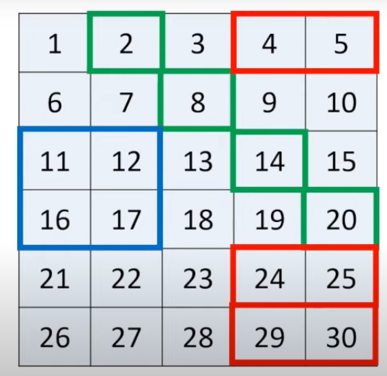
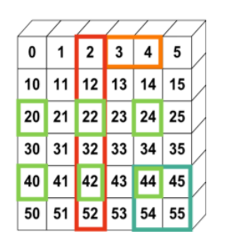
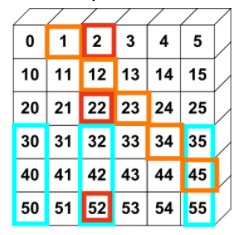

# Numpy time!

## ¿Cómo extraer los elementos que satisfacen una condición determinada?

Extraiga todos los números impares del siguiente array:

```python
arr = np.array([0, 1, 2, 3, 4, 5, 6, 7, 8, 9])
# SALIDA:
np.array([1, 3, 5, 7, 9])
```

> Pista: utilice indices booleanos

## Reemplazar los elementos de un array

Del mismo problema anterior, reemplaze por uno todos los elementos que son impares por `-1`

```python
arr = np.array([0, 1, 2, 3, 4, 5, 6, 7, 8, 9])
# SALIDA:
np.array([0, -1, 2, -1, 4, -1, 6, -1, 8, -1])
```

> Pista: además de acceder a un elemento de un array, también puede asignar valor en el momento en que accede a esta.

## Apilar dos matrices verticalmente

Genere una nueva matriz de forma que la matriz `b` quede por debajo de la matriz `a`. Imprima ambas matrices en caso de que no esté seguro de qué contienen.

```python
a = np.arange(10).reshape(2,-1)
b = np.repeat(1, 10).reshape(2,-1)

# SALIDA ESPERADA:
array([[0, 1, 2, 3, 4],
       [5, 6, 7, 8, 9],
       [1, 1, 1, 1, 1],
       [1, 1, 1, 1, 1]])
```

> Pista: busque en las guias de Numpy dentro de esta misma carpeta **"Reto"** las funciones _vstack_, _hstack_ y _concatenate_

## Concatenar dos matrices

De forma similar al anterior, coloque ambas matrices, esta vez, apiladas de forma horizontal

```python
a = np.arange(10).reshape(2,-1)
b = np.repeat(1, 10).reshape(2,-1)

# SALIDA ESPERADA:
array([[0, 1, 2, 3, 4, 1, 1, 1, 1, 1],
       [5, 6, 7, 8, 9, 1, 1, 1, 1, 1]])
```

## Secuencias

Genere la siguiente secuencia de forma automática mediante las funciones de `numpy`, tomando como entrada la matriz `a`

```python
a = np.array([1,2,3])
# SALIDA ESPERADA:
array([1, 1, 1, 2, 2, 2, 3, 3, 3, 1, 2, 3, 1, 2, 3, 1, 2, 3])
```

> Pista: busque en las guias de Numpy dentro de esta misma carpeta **"Reto"** las funciones _repeat_ y _tile_

## Elementos comunes

Obtenga un array con los elementos que tienen en común los arrays `a` y `b`

```python
a = np.array([1,2,3,2,3,4,3,4,5,6])
b = np.array([7,2,10,2,7,4,9,4,9,8])
# SALIDA ESPERADA:
array([2, 4])
```

> Pista: busque en google una función de Numpy que permita obtener la intersección de dos o más arrays

## Posiciones de aquellos elementos comunes

Esta vez, tomando los mismos arrays, obtenga las posiciones donde los elementos se repiten

```python
a = np.array([1,2,3,2,3,4,3,4,5,6])
b = np.array([7,2,10,2,7,4,9,4,9,8])
# SALIDA ESPERADA:
array([1, 3, 5, 7])
```

> Pista: busque en las guias de Numpy dentro de esta misma carpeta **"Reto"** o en Google la función _where_

## Extraer elementos dentro de un rango

Obtenga los elementos de un array que se encuentran entre 5 y 10

```python
a = np.array([2, 6, 1, 9, 10, 3, 27])
# SALIDA ESPERADA:
array([6, 9, 10])
```

## Generar un array por tramos

Defina un array `x` cuyo rango esté entre 0 y 500. Puede escoger el paso o la cantidad de elementos del array como desee. Después, genere otro array `y` de forma que su valor sea el reemplazo de `x` en las siguientes funciones:

- `y = 1 / 3 * (x ** 2) - 20`, desde 0 a 100
- `y = - 1 / 3 x + 5`, desde 101 a 350
- `y = - 5 * x + 2` desde 351 hasta 500.
  > Revise el video (Drive del curso) en el que explico la función piecewise para poder resolver este video

## Matrix Slicing

> Resuelva los siguientes tres retos con base en la guía de Slicing que se encuentran en esta carpeta **"Reto"**

A continuación, cree una matriz que contenga las filas, columnas y los números en cada posición, tal y como se muestra en la imagen.

> Hágalo mediante las funciones que Numpy provee para que no sea un proceso manual.

Una vez tiene la matriz, obtenga las tres porciones (hacer slicing) de la matriz que se simbolizan con cada color:


> Ejemplo de resultados:
> **Matriz Azul:** _np.array([ [ 11, 12 ], [ 16, 17 ] ])_ > **Matriz Roja:** _np.array([ [ 4, 5 ], [ 24, 25 ], [ 29, 30 ] ])_ > **Vector verde:** _np.array([ 2, 8, 14, 20 ])_

### Segunda matriz

Ahora haga el mismo proceso anterior con esta matriz. Primero genere su forma automáticamente y después obtenga cada matriz o vector, según corresponda.



### Última matriz

Realice el mismo proceso y extraiga submatrices o vectores. Slicing puede ser retador, por tanto, estos retos son suficientes para entenderlo de forma completa.


