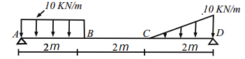

# Graph time!

## Análisis de fuerzas internas de una viga

Desarrolle un software en Python, a través de la herramienta de Jupyter Notebook que analice el siguiente sistema estructural compuesto por una viga que se encuentra simplemente apoyada, es decir, el apoyo localizado en `A` es un de segundo grado y el localizado en `D` de primer grado. Determine:

> Diagrama de fuerza cortante
> Diagrama de momento flector
> Fuerza cortante máxima
> Momentos máximos (positivos y negativos si los hay)

## Análisis de variaciones

Suponga que se varían ambas cargas distribuidas desde su carga original hasta 50kN/m extra, con pasos de 10kN/m.

> Es decir, la carga rectangular va desde 10kN/m hasta 60kN/m con pasos de 10 y lo mismo ocurre para la carga triangular

Obtenga el momento máximo positivo para cada caso de carga y realice los 6 gráficos en matplotlib (1 para cada caso) donde se evidencie la variación del momento máximo con respecto aumenta la carga.

> La gráfica debe tener en el `eje y` el valor del momento en kN-m y en el `eje x` el respectivo caso de carga para el cual se dio este fenómeno en kN/m (desde 10kN/m hasta 60kN/m)
